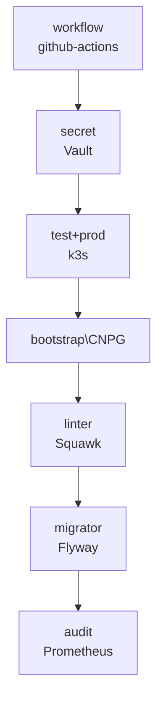

```mermaid
flowchart TB
    workflow["workflow\ngithub-actions"]
    secret["secret\nVault"]
    env["test+prod\nk3s"]
    bootstrap["bootstrap\CNPG"]
    linter["linter\nSquawk"]
    migrator["migrator\nFlyway"]
    audit["audit\nPrometheus"]

    workflow --> secret --> env --> bootstrap --> linter --> migrator --> audit
```