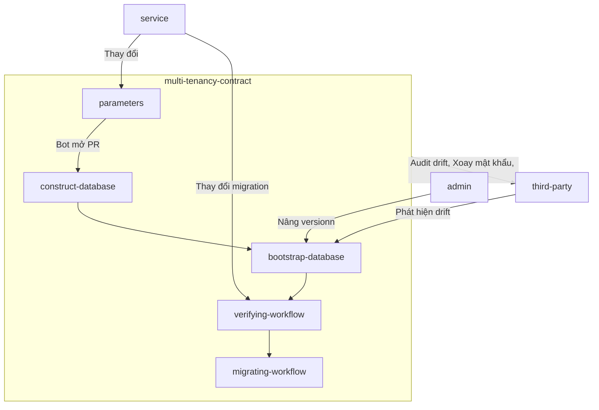

```mermaid
flowchart TB
    service-repo["service"]
    contract-admin["admin"]
    third-party
    subgraph contract-repo["multi-tenancy-contract"]
        parameters
        verifying-workflow
        migrating-workflow
        construct-database
        bootstrap-database

        parameters -->|Bot mở PR| construct-database
        construct-database --> bootstrap-database
        bootstrap-database --> verifying-workflow
        verifying-workflow --> migrating-workflow
    end

    service-repo -->|Thay đổi| parameters
    contract-admin -->|Nâng versionn| bootstrap-database
    third-party -->|Phát hiện drift| bootstrap-database
    service-repo -->|Thay đổi migration| verifying-workflow
    contract-repo -->|Audit drift, Xoay mật khẩu, Backup, ...| third-party
    
```