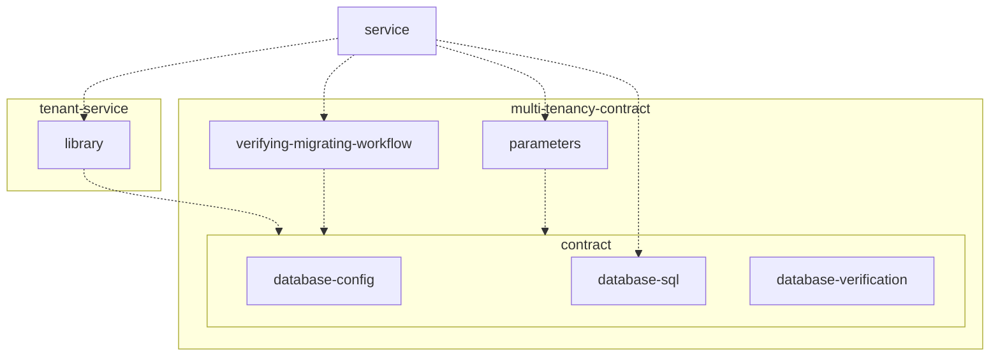

```mermaid
flowchart TB
    service-repo["service"]
    subgraph contract-repo["multi-tenancy-contract"]
        parameters
        migrating-workflow["verifying-migrating-workflow"]
        subgraph core["contract"]
            database-config
            database-sql
            database-verification
        end

        parameters -.-> core
        migrating-workflow -.-> core
    end
    subgraph tenant-repo["tenant-service"]
        library
    end

    service-repo -.-> parameters
    service-repo -.-> database-sql
    service-repo -.-> migrating-workflow
    service-repo -.-> library
    library -.-> core

```