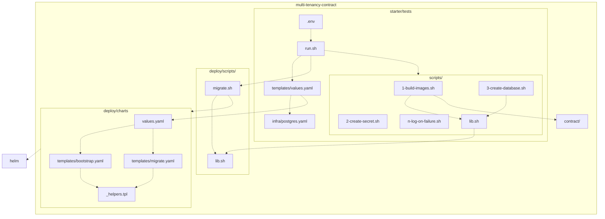

```mermaid
flowchart TD
    subgraph repo["multi-tenancy-contract"]
        subgraph starter_test["starter/tests"]
            run["run.sh"]
            env[".env"]
            template["templates/values.yaml"]
            db_config["infra/postgres.yaml"]

            subgraph script["scripts/"]
                build["1-build-images.sh"]
                secret["2-create-secret.sh"]
                database["3-create-database.sh"]
                log["n-log-on-failure.sh"]
                test_lib["lib.sh"]

                build -.-> test_lib
                database -.-> test_lib
            end

            env -.-> run

            run -.-> script
            run -.-> template

            template -.-> db_config
        end

        subgraph deploy["deploy/scripts/"]
            deploy_run["migrate.sh"]
            deploy_lib["lib.sh"]
        end

        subgraph chart["deploy/charts"]
            chart_template["values.yaml"]
            chart_bootstrap["templates/bootstrap.yaml"]
            chart_migration["templates/migrate.yaml"]
            chart_helper["_helpers.tpl"]

            chart_template -.-> chart_bootstrap
            chart_template -.-> chart_migration
            chart_migration -.-> chart_helper
            chart_bootstrap -.-> chart_helper
        end

        contract["contract/"]
    end

    helm["helm"]

    run -.-> deploy_run

    deploy_run -.-> deploy_lib
    deploy_run -.-> chart

    chart -.-> helm

    build -.-> contract

    test_lib -.-> deploy_lib

    template -.-> chart_template
```